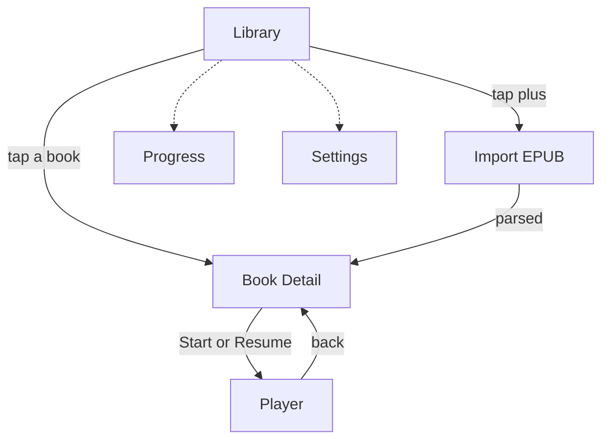

# Narrately — SPEC.md

*EBookListen*

## What it does
Turns a person's own ebook library into an audio-first habit, the way Headway turns nonfiction into a daily habit — except instead of a licensed library of summaries, it reads the person's actual books aloud using the phone's own text-to-speech voice, wrapped in the same daily-goal and streak mechanics that make Headway sticky.

## Who uses it and how
Someone with a folder of EPUBs — bought, self-published, or public domain — who owns more unread books than they'll ever get through by eye. They open the app on a commute or a run, hit play on wherever they left off, and listen. A small daily-minutes goal and a streak counter give them a reason to come back tomorrow, the same pull Headway uses, pointed at books they actually chose instead of a curated feed.

## Screens

- **Library (home).** Grid of imported books, cover and progress bar on each. A "Continue listening" card pinned at the top. Today's streak and minutes-listened sit in a small header widget. A plus button opens the file picker.
- **Book detail.** Cover, title, author, chapter list, a large Start / Resume button.
- **Player.** Full screen, opened from Book detail. Play/pause, skip back and forward by chapter or by a fixed number of seconds, speed control (0.75x–2x), current chapter name, a bookmark button, a sleep timer.
- **Progress.** Streak calendar showing which days hit the goal, minutes listened today and this week, a control to change the daily goal.
- **Settings.** Default voice (pulled from voices already on the phone), default speed, daily goal minutes, light/dark theme.

## Data

| Entity | Key fields |
|---|---|
| Book | id, title, author, filePath, coverPath?, chapterCount, importedAt |
| Chapter | id, bookId, index, title, textContent, wordCount |
| Progress | bookId, chapterId, charOffset, lastListenedAt |
| Bookmark | id, bookId, chapterId, charOffset, note?, createdAt |
| DailyStat | date, minutesListened, goalMet (bool) |
| Settings | voiceId, speechRate, dailyGoalMinutes, theme |

## Tech stack and hard constraints
- **Flutter + Dart, Android only.** Scaffold with `flutter create --platforms=android` so there's no `ios/` folder to maintain.
- **Portrait only, everywhere.** Set `android:screenOrientation="portrait"` on the main activity in `AndroidManifest.xml`, and call `SystemChrome.setPreferredOrientations([DeviceOrientation.portraitUp, DeviceOrientation.portraitDown])` in `main()` before `runApp`.
- **No backend. No login. No cloud sync in v1.** Everything lives on the device. This is what makes it buildable solo — don't introduce a server, an account system, or a database that isn't local.
- **TTS: `flutter_tts`.** Wraps Android's on-device TextToSpeech engine. Free, works offline, uses voices already installed on the phone. Do not integrate a cloud voice API in v1.
- **EPUB parsing: `epub_pro`.** Parses the EPUB spine and table of contents into chapters and plain text. Its predecessor `epubx` is effectively unmaintained — use `epub_pro`, not that.
- **File import: `file_picker`.**
- **Local storage: `sqflite`.** One local database holding Book, Chapter, Progress, Bookmark, DailyStat, Settings. No sync.
- **State management: Riverpod.** Pick this and stay consistent — don't let the agent mix in Provider or Bloc partway through.
- Confirm the current version of every package above on pub.dev before starting. Package versions move; this spec's job is to fix the architecture, not the version numbers.

## Explicitly out of scope for v1
- iOS, in any form.
- Landscape or tablet layouts.
- Accounts, login, cloud sync, multi-device anything.
- PDF, MOBI, or any format besides EPUB.
- AI-generated or written summaries — this is actually Headway's core content, and it needs either a human writer or an LLM pipeline. Real v2 idea, not v1.
- Subscriptions, paywalls, in-app purchases.
- Social features, sharing, leaderboards.
- Any TTS voice beyond what's already installed on the device.

## Done means (v1)
- A real EPUB imports from device storage and its chapters show up correctly.
- Tapping Start reads the current chapter aloud in the on-device voice and moves to the next chapter on its own.
- Play, pause, skip, and speed all work and are audibly different when changed.
- Closing and reopening the app resumes at the same chapter and roughly the same position.
- The Library screen's streak and minutes-listened numbers match what was actually played.
- Every screen stays portrait, confirmed by rotating a physical device or emulator.
- A malformed or DRM-protected EPUB fails with a readable error message, not a crash.

## Suggested build order
One `/plan`, one approved plan, one commit, per row below — see the vertical-slice workflow.

1. Import a file, parse it with `epub_pro`, list its chapters. No audio yet.
2. Wire `flutter_tts` to read the selected chapter aloud. Play / pause / stop only.
3. Auto-advance across chapters; save and restore playback position.
4. Skip controls, speed control, a voice picker from installed voices.
5. Daily-minutes tracking, streak logic, the Library header widget, the Progress screen.
6. Bookmarks, empty states, error handling for bad files, a final portrait-lock pass on every screen.
